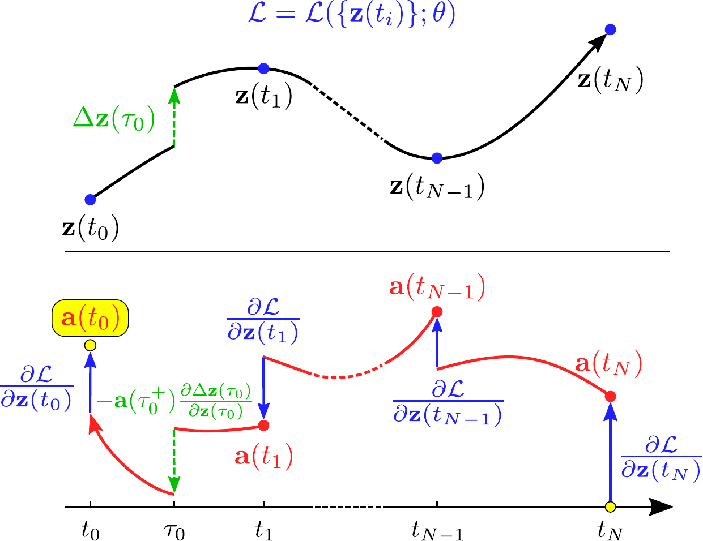

# Discontinuity Extension to Differentiable ODE Solvers

This branch extends neural ordinary differential equation (ODE) solver with discontinuities, which describes the abrupt change in latent state caused by events. 
Here we assume the continuous time dynamics is descriped by the following initial value problem (IVP).
```
dz = f(t, z) dt + w(t, z) dN     z(t_0) = z_0
```
where N(t) is the total number of events happend up to time t. This branch extend the 'adams' solver to handle the discontinuity in the IVP solution (as well as gradient backpropagation).
The algorithms in this brunch is currently only tested on CPU, and GPU implementation will be added in further updates.

---

<p align="center">
  
</p>

## Installation
```
pip install git+https://github.com/000Justin000/torchdiffeq.git@jj585
```

## Basic usage
We extend the `odeint_adjoint` interface to enable handling jump stochastic differental equations (JSDE). In our implementation, a JSDE is 
represented as `ODEJumpFunc` (a subclass of nn.Module in pytorch). The user need to implement the follwing functions that specifies a JSDE.
1) forward --- the dynamics of latent state.
2) next_simulated_jump ---  the time of the next event, used in simulation.
3) simulated_jump --- the simulated jump in the latent state, used in simulation.
4) next_read_jump --- read next event time from input event data, used in training.
5) read_jump --- the jump in latent state from input event data, used in training.

For an example implementation of those functions, please see [modules.py](examples/modules.py). Then, the ODEJumpFunc can be passed in as
an argument to the `odeint_adjoint` for simulating latent dynamics and stochastic events with the following.
```
odeint(func, z0, tsave, method='jump_adams', rtol=rtol, atol=atol)
```
where `func` is an ODEJumpFunc object, `z0` is the initial latent state, and `tsave` contains the timestamps at which the latent state is recorded.
For a full example usage of the libaray, please see [examples/](examples/).

If you found this library useful in your research, please consider citing
```
@ARTICLE{2019arXiv190510403J,
       author = {{Jia}, Junteng and {Benson}, Austin R.},
        title = "{Neural Jump Stochastic Differential Equations}",
      journal = {arXiv e-prints},
     keywords = {Computer Science - Machine Learning, Statistics - Machine Learning},
         year = "2019",
        month = "May",
          eid = {arXiv:1905.10403},
        pages = {arXiv:1905.10403},
archivePrefix = {arXiv},
       eprint = {1905.10403},
 primaryClass = {cs.LG},
       adsurl = {https://ui.adsabs.harvard.edu/abs/2019arXiv190510403J},
      adsnote = {Provided by the SAO/NASA Astrophysics Data System}
}
